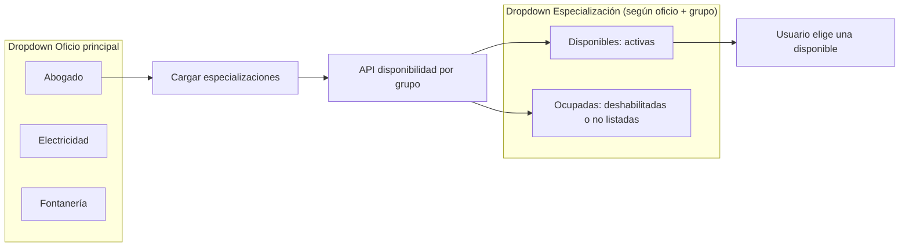

# Diagrama y flujo de registro de aliados (oficios jerárquicos)

Sistema tipo RUANA con **catálogo jerárquico**: oficio principal → especializaciones. **Una plaza por especialización por grupo** (si está ocupada, se bloquea o no se muestra).

---

## 1. Modelo del catálogo

Cada oficio principal tiene varias especializaciones. Ejemplo de estructura:

```json
{
  "descripcion": "Catálogo jerárquico: oficio principal + especializaciones (una plaza por especialización por grupo).",
  "oficios": [
    {
      "nombre": "Abogado",
      "especializaciones": ["Mercantil", "Familiar", "Penal", "Laboral"]
    },
    {
      "nombre": "Electricidad",
      "especializaciones": ["Instalaciones", "Domótica", "Energía solar", "Mantenimiento industrial"]
    },
    {
      "nombre": "Fontanería",
      "especializaciones": ["Residencial", "Industrial", "Calefacción", "Saneamiento"]
    }
  ]
}
```

---

## 2. Almacenamiento en BD

| Campo en aliados | Tipo | Descripción |
|------------------|------|-------------|
| **oficio_principal** | TEXT | Nombre del oficio principal (ej. "Abogado"). |
| **especializacion** | TEXT | Sub-oficio elegido (ej. "Mercantil"). **Una sola** por aliado; ocupa plaza en el grupo. |
| **grupo_id** | INTEGER (FK) | Grupo asignado (según CP y disponibilidad de la especialización). |

**Regla de plaza:** En cada grupo, la combinación efectiva que ocupa plaza es **(grupo_id, oficio_principal, especializacion)**. No puede haber dos aliados activos en el mismo grupo con la misma especialización.

Opcional: tabla de plazas por grupo para consultas rápidas:

| Tabla **grupo_plazas** (opcional) | |
|----------------------------------|---|
| grupo_id | FK grupos |
| oficio_principal | TEXT |
| especializacion | TEXT |
| aliado_id (o codigo) | FK aliados / único |
| PRIMARY KEY (grupo_id, oficio_principal, especializacion) |

---

## 3. Diagrama de flujo del registro

```mermaid
flowchart TD
    INICIO([Inicio registro]) --> DATOS_BASE[Datos base: nombre, email, teléfono, CP]
    DATOS_BASE --> CODIGO_INV[¿Código invitación?]
    CODIGO_INV -->|Sí| GRUPO_PREF[Grupo preferido = grupo del invitador]
    CODIGO_INV -->|No| SIN_GRUPO_PREF[Sin grupo preferido]
    GRUPO_PREF --> DROPDOWN_OFICIO[Dropdown: Seleccionar oficio principal]
    SIN_GRUPO_PREF --> DROPDOWN_OFICIO

    DROPDOWN_OFICIO --> CARGAR_ESP[API: Cargar especializaciones del oficio]
    CARGAR_ESP --> API_DISP[API: Obtener disponibilidad por grupo]
    API_DISP --> FILTRAR[Filtrar: especializaciones ocupadas vs disponibles por grupo]

    FILTRAR --> DROPDOWN_ESP[Dropdown: Seleccionar especialización]
    DROPDOWN_ESP --> ESP_DISP[Mostrar solo especializaciones DISPONIBLES en grupo destino]
    ESP_DISP --> BLOQUEO[Ocupadas: bloqueadas o no visibles]

    BLOQUEO --> USUARIO_ELIGE[Usuario elige especialización disponible]
    USUARIO_ELIGE --> VALIDAR[Validar disponibilidad antes de confirmar]
    VALIDAR --> DISP_OK{¿Sigue disponible?}
    DISP_OK -->|No| MSG_OCUPADA[Mostrar: "Plaza ocupada. Elige otra."]
    MSG_OCUPADA --> DROPDOWN_ESP
    DISP_OK -->|Sí| CONFIRMAR[Confirmar registro]
    CONFIRMAR --> ASIGNAR_GRUPO[Asignar grupo: preferido o buscar/crear por CP]
    ASIGNAR_GRUPO --> GUARDAR[(Guardar en BD: oficio_principal, especializacion, grupo_id)]
    GUARDAR --> FIN([Registro completado])
```

---

## 4. Flujo de validación de disponibilidad

```mermaid
sequenceDiagram
    participant U as Usuario
    participant UI as Frontend
    participant API as Backend
    participant BD as Base de datos

    U->>UI: Selecciona oficio principal
    UI->>API: GET /api/catalogo/oficios (o oficios con especializaciones)
    API->>BD: Leer catálogo
    API-->>UI: Lista oficios + especializaciones por oficio

    U->>UI: Selecciona especialización (solo disponibles)
    Note over UI: Disponibilidad según grupo destino (CP o invitación)

    UI->>API: GET /api/grupos/especializaciones-disponibles?cp=XXX&oficio=Abogado&grupo_id=?
    API->>BD: Grupos en CP; plazas ocupadas (grupo_id, oficio, especializacion)
    API-->>UI: Lista especializaciones con estado: disponible | ocupada

    UI->>UI: Mostrar dropdown: disponibles activas, ocupadas deshabilitadas o ocultas

    U->>UI: Elige especialización + Confirma
    UI->>API: POST /api/aliados/registrar { oficio_principal, especializacion, ... }

    API->>API: Validar disponibilidad (grupo, oficio, especializacion)
    alt Plaza ya ocupada (condición de carrera)
        API-->>UI: 409 "La especialización ya no está disponible"
        UI-->>U: Pedir elegir otra
    else OK
        API->>BD: INSERT aliado; asignar grupo_id; registrar plaza
        API-->>UI: 201 Registro correcto
    end
```

---

## 5. Actualización dinámica en la UI



**Comportamiento en UI:**

- **Oficio principal:** dropdown con todos los oficios del catálogo.
- **Especialización:** dropdown que se rellena al elegir oficio. Solo se muestran como elegibles las especializaciones **disponibles** en el grupo destino (grupo por invitación o grupo(s) del CP).
- **Ocupadas:** se marcan como "No disponible" o no se muestran.
- Si cambia el oficio principal, se vuelve a pedir disponibilidad y se actualiza el dropdown de especialización.

---

## 6. Resumen del flujo (pasos)

| Paso | Acción | Detalle |
|------|--------|---------|
| 1 | Datos base | Nombre, email, teléfono, código postal (y opcional código invitación). |
| 2 | Dropdown oficio | Selección del **oficio principal** desde el catálogo jerárquico. |
| 3 | Cargar especializaciones | Al elegir oficio, se cargan sus especializaciones. |
| 4 | Disponibilidad | Se llama a la API con CP (y grupo_id si hay invitación) para saber qué especializaciones están libres en el grupo destino. |
| 5 | Dropdown especialización | Solo se permiten elegir especializaciones **disponibles**; el resto bloqueadas o no visibles. |
| 6 | Validación al confirmar | Antes de guardar, se valida de nuevo en servidor que la plaza (grupo + oficio + especialización) siga libre. |
| 7 | Asignación de grupo | Se asigna grupo (invitación o buscar/crear por CP). |
| 8 | Almacenamiento | Se guarda `oficio_principal`, `especializacion`, `grupo_id` y el resto de datos del aliado. |

---

## 7. Diagrama de datos (almacenamiento)

```mermaid
erDiagram
    CATALOGO {
        string nombre_oficio "oficio principal"
        array especializaciones "lista de strings"
    }

    ALIADOS {
        int id PK
        string codigo UK
        string oficio_principal "nombre oficio"
        string especializacion "sub-oficio elegido"
        int grupo_id FK
        string codigo_postal
        string nombre
        string email
        string telefono
    }

    GRUPOS {
        int id PK
        string nombre
        string codigo_postal
        string estado
    }

    GRUPO_PLAZAS {
        int grupo_id FK
        string oficio_principal
        string especializacion
        string aliado_codigo FK
    }

    GRUPOS ||--o{ ALIADOS : "tiene"
    GRUPOS ||--o{ GRUPO_PLAZAS : "plazas"
    ALIADOS }o--|| GRUPO_PLAZAS : "ocupa"
    CATALOGO ..> ALIADOS : "oficio_principal + especializacion"
```

---

## 8. API sugeridas

| Método | Ruta | Uso |
|--------|------|-----|
| GET | `/api/catalogo/oficios` | Catálogo jerárquico (oficio + especializaciones). |
| GET | `/api/grupos/especializaciones-disponibles?codigo_postal=...&oficio_principal=...&grupo_id=...` | Para cada especialización del oficio: disponible u ocupada en el grupo (o grupos del CP). |
| POST | `/api/aliados/registrar` | Body: `oficio_principal`, `especializacion`, nombre, email, telefono, codigo_postal, codigo_invitacion (opcional). Valida disponibilidad y guarda. |

Con esto queda definido el **diagrama y flujo de registro de aliados** con oficios jerárquicos, bloqueo dinámico por plaza y almacenamiento en BD.

---

## 9. Integración en el proyecto RUANA

La lógica anterior está integrada en el código:

| Componente | Ubicación | Detalle |
|------------|-----------|---------|
| **Catálogo jerárquico** | `config/oficios_ruana.json` | Estructura `{ "nombre", "especializaciones": [] }`. |
| **BD** | `core/db_manager.py` | Columna `especializacion` (migración), `_grupo_tiene_plaza`, `obtener_especializaciones_ocupadas`, `plaza_ocupada_en_grupo`, `buscar_grupo_sin_oficio(..., especializacion)`, `crear_aliado(..., especializacion=)`, `get_catalogo_oficios_jerarquico()`. |
| **API** | `web/app.py` | `GET /api/catalogo/oficios` (jerárquico), `GET /api/grupos/especializaciones-disponibles`, `POST /api/aliados/registrar` (valida disponibilidad, envía `especializacion`, 409 si plaza ocupada). |
| **UI registro** | `web/register.html` | Dropdown oficio principal → dropdown especialización; se rellena con disponibilidad por CP; opciones ocupadas deshabilitadas con "(No disponible)"; validación y envío de `especializacion`. |
