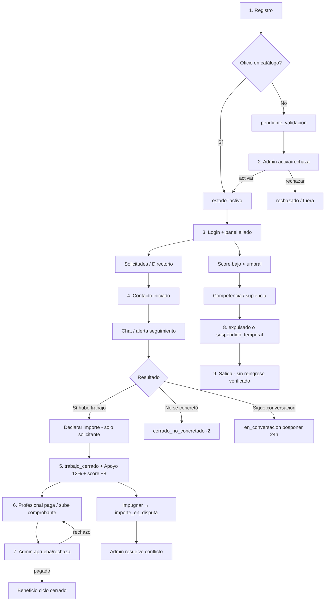

# Auditoría completa del sistema de seguimiento de aliados (RUANA)

**Fecha:** 2026-07-22  
**Alcance:** Frontend, backend Flask, SQLite/Postgres (Supabase), Storage, Firebase Hosting, lógica de negocio, seguridad, UX.  
**Método:** Revisión de código y migraciones existentes. Sin ejecución en producción.  
**Limitaciones:** No se verificó el entorno de producción real (`DATABASE_URL`, secretos GCP, datos vivos). Donde falte evidencia, se indica explícitamente.

---

## 1. Resumen ejecutivo

El seguimiento de aliados en RUANA es un **sistema monolítico Flask** (`RUANA/web/app.py` + `RUANA/core/db_manager.py`) con paneles HTML (`aliado.html`, `admin.html`) y persistencia dual (SQLite local / Postgres vía `DATABASE_URL`). Firebase Hosting actúa como proxy a Cloud Run; **no hay Cloud Functions ni Edge Functions**. Supabase aporta schema SQL, RLS, Storage y publicación Realtime, pero el frontend **no consume Realtime** (usa polling) y Flask **bypasea RLS** con conexión directa / service role.

**Estado general: operativo parcialmente, con fallos de autorización y deuda de dominio que pueden romper o manipular el seguimiento.**

Lo que funciona de extremo a extremo (con la lógica actual):

1. Registro → activación admin (si pendiente) → login con sesión `X-Ruana-Session-Id`.
2. Solicitudes de grupo → contacto RUANA → chat → cierre con importe (solo solicitante) o no concretado → Apoyo RUANA → comprobante → revisión admin.
3. Score operativo en `aliados.score` con límites ±10/día e historial en `score_movimientos`.

**Bloqueadores críticos / altos antes de producción:**

| # | Problema | Severidad |
|---|----------|-----------|
| P1 | Cualquier aliado autenticado puede cerrar o posponer contactos ajenos si conoce el ID | Crítico |
| P2 | Declaración de importe unilateral del solicitante genera Apoyo y +8 a ambas partes; doble declaración documentada pero inalcanzable | Alto |
| P3 | Admin solo lectura puede forzar suplencia y abrir plaza | Alto |
| P4 | Comprobantes en bucket privado se guardan con `get_public_url()` (acceso admin/UX frágil o exposición si se hace público) | Alto |
| P5 | Seguridad real depende de decoradores Flask; RLS no protege el API | Alto |

El Roadmap (`ROADMAP.md`) ya identifica parte de esto en Hitos 2–4. Varios hallazgos del plan QA siguen vigentes; algunos (uploads a `static/uploads`, allowlist de conflictos) están **parcialmente obsoletos** frente al código actual.

---

## 2. Inventario

### 2.1 Arquitectura relacionada con seguimiento

```text
Aliado (identidad) → Solicitud (grupo) → Contacto RUANA (encargo)
                                      → Chat
                                      → Declaración importe / No concretado
                                      → Apoyo RUANA / Pagos / Conflictos
                                      → Score / Competencia / Purga
                                      → Notificaciones / Audit / Eventos
```

| Capa | Componentes |
|------|-------------|
| Frontend aliado | `RUANA/web/aliado.html`, `register.html`, `invite.html`, `index.html` |
| Frontend admin | `RUANA/web/admin.html`, `dashboard.html` |
| API | `RUANA/web/app.py` (~3900 líneas) |
| Dominio / DB | `RUANA/core/db_manager.py` (~8000 líneas) |
| Score evaluativo | `RUANA/engines/motor_evaluacion.py` + `core/orquestador.py` |
| Storage | `RUANA/core/storage_manager.py`, `supabase_client.py` |
| Config | `config/ruana_reglas_v1.json`, `oficios_ruana.json`, `admin_codes.json` |
| Schema | `supabase/migrations/20260519000100_*.sql` (+ compat + foto perfil) |
| Docs | `RUANA/docs/LOGICA_CHAT_Y_ALERTA.md`, `FLUJO_REGISTRO_ALIADOS_OFICIOS.md`, `AUTENTICACION_SESIONES_SEGURAS.md`, `RUANA/README.md`, `docs/QA_TESTING_PLAN_RUANA.md` |
| Tests | `RUANA/tests/test_*`, `e2e/ruana-critical-flows.spec.js` |

### 2.2 Tablas de seguimiento

| Tabla | Rol en el seguimiento |
|-------|------------------------|
| `aliados` | Identidad, `estado`, `score`, grupo, oficio, pagos QR/Bizum, foto |
| `grupos` | Agrupación por CP; competencia |
| `solicitudes` | Necesidades del grupo (enviadas/recibidas) |
| `contactos_ruana` | Encargo / seguimiento operativo central |
| `chat_mensajes` | Chat del contacto |
| `contacto_panel_oculto` | “Finalizar chat” = ocultar del panel personal |
| `contacto_penalizaciones_aplicadas` | Penalizaciones 7d/21d por contacto abierto |
| `confirmaciones_trabajo` | Declaraciones de importe |
| `ingresos_ruana` | Apoyo generado (`apoyo_ruana_2pct` nombre legacy) |
| `notificaciones_aliado` | Alertas de cobro, rechazo, disputa |
| `payment_conflicts` | Impugnaciones / discrepancias |
| `score_movimientos` | Auditoría de score operativo |
| `evaluaciones` / `evaluaciones_historico` | Motor de evaluación (paralelo al score operativo) |
| `competencia` | Suplencia por bajo score |
| `invitaciones` / `referidos` / `invitacion_campanas` | Entrada al sistema y red |
| `eventos_sistema` / `audit_log` | Trazabilidad |
| `avisos_grupo` / `grupo_oficio_cerrado` | Avisos y plazas |

### 2.3 Estados del aliado (persistidos en código)

| Estado | Origen típico | Login |
|--------|---------------|-------|
| `activo` | Registro con oficio en catálogo / activación admin | Sí |
| `pendiente_validacion` | Oficio/suboficio fuera de catálogo | No |
| `pendiente_completar` | Placeholder de invitación | **No bloqueado explícitamente** |
| `rechazado` | Admin | No |
| `suspendido_temporal` | Pausa admin / purga | No |
| `expulsado` | Competencia perdida repetida | No |
| `sistema` | Excluido en referidos | N/A |

Estados visuales UI (`inactivo`, `observacion`, `riesgo`) **no** son estados persistidos de `aliados`; el “estado RUANA” visible es derivado: `PRIORITARIO` / `ESTABLE` / `EN RIESGO` / `COMPETENCIA` desde `score`.

### 2.4 Estados del contacto (`contactos_ruana.estado`)

| Estado | Significado |
|--------|-------------|
| `iniciado` | Contacto creado |
| `aceptado` | Profesional aceptó (API existe; UI principal no lo dispara claramente) |
| `trabajo_en_progreso` | Marcado en progreso (API con check de pertenencia) |
| `en_conversacion` | Posponer alerta (`posponer_recordatorio` + `fecha_pospuesto_hasta`) |
| `chat_agotado` | Límite de mensajes alcanzado |
| `trabajo_cerrado` | Importe confirmado; Apoyo generado |
| `cerrado_no_concretado` | Cierre sin trabajo (−2 score) |
| `no_concretado` | Legacy; delega a `cerrado_no_concretado` |
| `importe_en_disputa` | Conflicto / impugnación |

### 2.5 Estados de pago (`estado_pago`)

`no_generado` → `pendiente_pago` → `en_revision` → `pagado`  
Rechazo admin: API acepta `rechazado` pero **persiste** de nuevo `pendiente_pago`.

### 2.6 APIs centrales de seguimiento

- Auth aliado: `/api/aliado/login|sesion|logout|datos`
- Registro: `POST /api/aliados/registrar`
- Solicitudes: `GET|POST /api/solicitudes`, `.../atender`
- Contactos: `POST /api/contactos`, `.../aceptar`, `.../trabajo-en-progreso`, `.../no-concretado`, `.../en-conversacion`, `.../declarar-importe`, `.../comprobante-apoyo`, `.../impugnar-apoyo`, `.../finalizar-chat`
- Chat: `/api/chat_mensajes`, `/api/chat_enviar` (+ aliases `/api/chat/*` y `/api/contactos/<id>/mensajes`)
- Pagos admin: `/api/admin/pagos-*`, `.../estado-pago`, `payment-conflicts`
- Score/eval: `/api/evaluaciones*`, competencia, purga
- Admin aliados: pendientes, activar, rechazar, pausar

### 2.7 Infra no presente / no cableada

- **No hay** `functions/` ni `supabase/functions/` (sin Edge/Cloud Functions).
- **No hay** cliente Supabase Realtime en frontend (solo publicación en migración).
- **No hay** sync bidireccional SQLite ↔ Postgres; se elige backend por `DATABASE_URL`.
- Firebase: Hosting + rewrite a Cloud Run; no Firestore como fuente de verdad del seguimiento.

---

## 3. Mapa del flujo de seguimiento (ciclo de vida)



### Puntos del flujo con errores / incompletos

| Paso | Estado | Problema |
|------|--------|----------|
| 1 Registro | Parcial | Placeholders `pendiente_completar` pueden pasar login |
| 2 Aprobación | OK | Activar/rechazar con `require_admin_escritura` |
| 3 Interacción | Parcial | Aceptar / trabajo-en-progreso poco cableados en UI |
| 4 Encargos | **Roto en permisos** | `no-concretado` / `en-conversacion` sin validar pertenencia |
| 5 Score | Parcial | Score operativo OK; motor evaluativo desconectado; métricas ignoran `cerrado_no_concretado` |
| 6 Beneficios | Parcial | Apoyo 12% en config; docs dicen 15%; nombre columna `2pct` |
| 7 Finalización | Parcial | “Finalizar chat” solo oculta panel; no cierra contacto |
| 8 Pagos | Parcial | Flujo OK; URLs públicas de buckets privados; `rechazado` no persiste |
| 9 Cambio estado | Parcial | `forzar_suplencia` incompleta vs automática; admin lectura puede ejecutarla |
| 10 Salida | Incompleto | Sin API de readmisión para `expulsado` / `suspendido_temporal` |

---

## 4. Problemas encontrados (por gravedad)

### P1 — Crítico: cierre/posposición de contactos ajenos

- **Descripción:** `POST /api/contactos/<id>/no-concretado` y `.../en-conversacion` no comprueban que el aliado de sesión sea solicitante o profesional. Contrasta con `trabajo-en-progreso` y chat, que sí validan.
- **Causa raíz:** Autorización incompleta en capa API y DB (`marcar_cerrado_no_concretado`, `marcar_en_conversacion` usan `actor_codigo` solo para audit).
- **Archivos:** `RUANA/web/app.py` (~1580–1612), `RUANA/core/db_manager.py` (~4796–4904)
- **Funciones:** `marcar_contacto_no_concretado`, `marcar_contacto_en_conversacion`, `marcar_cerrado_no_concretado`, `marcar_en_conversacion`
- **Tablas:** `contactos_ruana`, `score_movimientos`, `audit_log`
- **Flujo:** Encargos → cierre / posponer alerta
- **Impacto:** Un atacante con sesión de aliado y un `contacto_id` puede cerrar encargos ajenos (−2 a ambas partes) u ocultar alertas.
- **Riesgo futuro:** Fraude de score y sabotaje de seguimiento a escala.
- **Recomendación:** Exigir pertenencia en API y DB (mismo patrón que `marcar_trabajo_en_progreso`). Añadir tests de permisos.

### P2 — Alto: modelo de doble declaración vs cierre unilateral

- **Descripción:** Comentarios/docs hablan de doble declaración. El código bloquea a quien no sea solicitante y cierra con una sola declaración (`importe_prof is None` → `trabajo_cerrado`), genera Apoyo y notifica. `app.py` aplica +8 a ambos.
- **Causa raíz:** Cambio de producto incompleto; rama de discrepancia por doble importe queda inalcanzable por UI/API normal.
- **Archivos:** `db_manager.py::registrar_importe_contacto`, `app.py::declarar_importe_contacto`, `LOGICA_CHAT_Y_ALERTA.md`, `docs/QA_TESTING_PLAN_RUANA.md`
- **Tablas:** `contactos_ruana`, `confirmaciones_trabajo`, `ingresos_ruana`, `notificaciones_aliado`, `score_movimientos`, `payment_conflicts`
- **Flujo:** Confirmación → score → pagos
- **Impacto:** Profesional no confirma importe pero recibe score y deuda de Apoyo; disputas “por importes distintos” casi no ocurren (solo vía impugnación posterior).
- **Recomendación:** Decisión de producto explícita. Si unilateral: limpiar docs/código muerto y mensajes. Si bilateral: eliminar bypass `importe_prof is None` y habilitar declaración del profesional.

### P3 — Alto: admin solo lectura puede escribir en suplencia/plaza

- **Descripción:** `forzar-suplencia` y `abrir-plaza` usan `@require_admin` en lugar de `@require_admin_escritura`.
- **Causa raíz:** Decorador incorrecto (ya listado en QA plan).
- **Archivos:** `app.py` (~3293–3310, ~3428–3444)
- **Tablas:** `competencia`, `grupos`, `grupo_oficio_cerrado`, `aliados`
- **Impacto:** Admin de solo lectura altera plazas/competencias.
- **Recomendación:** Cambiar a `@require_admin_escritura` + tests.

### P4 — Alto: comprobantes con URL pública en bucket privado

- **Descripción:** Uploads a `ruana-comprobantes` / conflictos usan `get_public_url()`. Buckets son privados en migración. Admin renderiza el link directo.
- **Causa raíz:** Storage helper no distingue bucket público vs privado (signed URL).
- **Archivos:** `storage_manager.py`, `app.py` (comprobante/impugnación), `admin.html`, migración init
- **Impacto:** Links rotos para admin o, si se hace público el bucket, exposición de comprobantes.
- **Recomendación:** Signed URLs de corta duración o endpoint autenticado de descarga.

### P5 — Alto: RLS no protege el API Flask

- **Descripción:** Flask usa `DATABASE_URL` con `psycopg` y Storage con service role. RLS solo aplica a clientes Supabase Auth.
- **Causa raíz:** Arquitectura backend privilegiado.
- **Archivos:** `db_manager.py`, `postgres_compat.py`, `supabase_client.py`, migraciones RLS
- **Impacto:** Cualquier endpoint mal protegido bypassa RLS. No es un bug por sí solo, pero eleva la severidad de P1/P3.
- **Recomendación:** Tratar decoradores Flask + tests de permisos como control primario; documentar que RLS es defensa en profundidad solo para acceso directo a Supabase.

### P6 — Alto: atender la propia solicitud por API

- **Descripción:** `atender_solicitud_por_id` solo exige mismo grupo, no `solicitante_codigo != codigo`.
- **Archivos:** `db_manager.py` (~4458–4486)
- **Tablas:** `solicitudes`
- **Impacto:** Manipulación de métricas de solicitudes contestadas.
- **Recomendación:** Rechazar si el atendente es el solicitante.

### P7 — Medio/Alto: `pendiente_completar` no bloqueado en login

- **Descripción:** Login/datos bloquean expulsado, pendiente_validacion, rechazado, suspendido_temporal; **no** `pendiente_completar`.
- **Archivos:** `app.py::aliado_login`, `get_aliado_datos`
- **Impacto:** Placeholder de invitación podría entrar al panel incompleto.
- **Recomendación:** Bloquear o forzar redirección a completar registro.

### P8 — Medio: `importe_en_disputa` a la vez “final” y “abierto”

- **Descripción:** Está en `_ESTADOS_FINALES_CONTACTO` (bloquea chat/transiciones) y en contactos abiertos (alerta).
- **Archivos:** `db_manager.py` (~4784–4787, ~5737, ~5783)
- **Impacto:** UX confusa; no se puede chatear durante disputa.
- **Recomendación:** Definir semántica: “abierto operativo con acciones restringidas” vs “final”.

### P9 — Medio: `cerrado_no_concretado` vs métricas `no_concretado`

- **Descripción:** Cierre escribe `cerrado_no_concretado`; `obtener_metricas_motor_por_aliado` cuenta `no_concretado`.
- **Archivos:** `db_manager.py` (~4828–4835, ~5659–5662)
- **Impacto:** Tasas de confirmación del motor subestimadas → evaluaciones incorrectas.
- **Recomendación:** Unificar nombre o incluir ambos en métricas.

### P10 — Medio: motor de evaluación desconectado del score operativo

- **Descripción:** `MotorEvaluacion` guarda `evaluaciones` y calcula `delta_score` pero **no** llama `aplicar_cambio_score`. Competencia solo se dispara al cruzar umbral en score operativo.
- **Archivos:** `engines/motor_evaluacion.py`, `db_manager.py::aplicar_cambio_score`, `orquestador.py`
- **Impacto:** Evaluaciones “rojas” no bajan score ni abren competencia.
- **Recomendación:** Decidir: motor informativo (docs) o aplicar deltas al score operativo.

### P11 — Medio: `forzar_suplencia` incompleta

- **Descripción:** Inserta fila en `competencia` sin mover suplente al grupo, sin `grupos.estado=en_competencia`, sin scores iniciales, sin aviso (el flujo automático sí lo hace).
- **Archivos:** `db_manager.py::forzar_suplencia` vs `_iniciar_competencia_si_procede`
- **Impacto:** Competencias admin inconsistentes; finalización con datos parciales.
- **Recomendación:** Reutilizar la misma rutina del flujo automático.

### P12 — Medio: `estado_pago=rechazado` no se persiste

- **Descripción:** Admin envía `rechazado`; DB escribe `pendiente_pago` y retorna el valor solicitado.
- **Archivos:** `db_manager.py::actualizar_estado_pago_contacto` (~6375–6408)
- **Impacto:** Confusión admin/UI sobre estado real.
- **Recomendación:** Responder con el estado persistido o persistir un estado intermedio explícito.

### P13 — Medio: docs de chat desalineadas (5 vs 30)

- **Descripción:** Docs dicen 5 mensajes/usuario; código/tests usan `CHAT_MAX_MENSAJES_TOTAL = 30`.
- **Archivos:** `LOGICA_CHAT_Y_ALERTA.md`, `db_manager.py` (~4593–4594), `test_chat_timestamp_state.py`
- **Impacto:** QA/producto con expectativas erróneas.
- **Recomendación:** Actualizar docs a la regla real.

### P14 — Medio: métricas de “abiertos” subcuentan alertas reales

- **Descripción:** `obtener_metricas_contactos` cuenta solo `iniciado|aceptado|trabajo_en_progreso`; alertas incluyen también disputa/conversación/agotado.
- **Impacto:** Dashboard subestima carga.
- **Recomendación:** Unificar definición de “abierto”.

### P15 — Medio: sesiones en memoria

- **Descripción:** `_RUANA_SESSION_STORE` en proceso Flask; multi-instancia Cloud Run pierde/invalida sesiones de forma inconsistente.
- **Archivos:** `app.py` (~61–131)
- **Impacto:** Logouts aleatorios / sesiones no compartidas entre workers (mitigado parcialmente con JWT fallback).
- **No verificado en producción:** número de instancias/workers reales.
- **Recomendación:** Store compartido (Redis) o JWT firmado como fuente única (Hito 3 roadmap).

### P16 — Medio: sin ruta de reingreso post-salida

- **Descripción:** No hay API verificada para reactivar `expulsado` o `suspendido_temporal` (activar solo desde `pendiente_validacion`).
- **Impacto:** Salidas operativamente irreversibles.
- **Recomendación:** Flujo admin de readmisión + audit.

### P17 — Bajo/Medio: endpoints y UI legacy / duplicados

- Aliases: `finalizar-chat` / `finalizar_chat`; chat triple; conflictos `payment-conflicts` / `conflictos-pago`.
- Endpoints `/aceptar` y `/trabajo-en-progreso` sin botones claros en `aliado.html` (flujo real: crear contacto → chat → cierre).
- Pantallas `private-panel*.html`, `INTEGRATION_EXAMPLES.py`, stubs orquestador/trading.
- **Recomendación:** Deprecar aliases con tests; cablear o retirar estados muertos de UI.

### P18 — Bajo: porcentaje Apoyo y nombres legacy

- Config/código: **12%**. README: **15%**. Columna: `apoyo_ruana_2pct`.
- **Recomendación:** Una sola fuente de verdad documentada; renombrar columna en migración.

### P19 — Bajo: Realtime preparado pero no usado

- Migración publica `chat_mensajes`, `notificaciones_aliado`, `contactos_ruana`.
- Frontend: polling chat 5s; notificaciones al volver a pestaña.
- **Impacto:** Latencia/UX; no es fallo funcional del seguimiento.
- **Recomendación:** Cliente Realtime o documentar polling como diseño definitivo.

### P20 — Bajo: endpoints públicos de metadata

- Públicos: `/api/contactos/metricas`, `/api/filtros`, catálogos, validar invitación.
- Listados sensibles de aliados ya protegidos con admin en buena parte.
- **Recomendación:** Autenticar métricas agregadas si se consideran inteligencia operacional.

---

## 5. Funcionalidades incompletas o desconectadas

| Funcionalidad | Estado |
|---------------|--------|
| Doble declaración de importes | Modelo/columnas existen; flujo real unilateral |
| Motor → score operativo / competencia | Desconectado |
| Aceptar contacto / trabajo en progreso desde UI principal | API sí, UI no cableada de forma evidente |
| Realtime Supabase en panel | Schema sí, cliente no |
| Edge / Cloud Functions | No existen |
| Sync SQLite ↔ Supabase | No existe; backend único por entorno |
| Reingreso tras expulsión/suspensión | No verificado / ausente |
| `forzar_suplencia` completa | Parcial |
| Orquestador / MetricsCollector en producción web | Orquestador separado; métricas de ejemplo en collector; no es el path del panel web |
| Tabla `grupo_plazas` del doc de registro | Documentada como opcional; lógica usa consultas sobre `aliados` |
| CHECK constraint en `aliados.estado` | Ausente en SQLite y Postgres |

---

## 6. Riesgos futuros

1. **Escalada de abuso de contactos** si se enumeran IDs (P1).
2. **Contabilidad / confianza rota** si se vende doble confirmación pero se cobra por declaración unilateral (P2).
3. **Competencias fantasma** por `forzar_suplencia` (P11) + admin lectura (P3).
4. **Pérdida de sesiones** al escalar Cloud Run (P15).
5. **Evaluaciones que no reflejan cierres reales** por nombre de estado (P9) → decisiones de purga/competencia erróneas si se conecta el motor.
6. **Documentación desfasada** (chat 5 vs 30, apoyo 15 vs 12, static uploads vs Supabase) → regresiones en QA.
7. **Sin Edge Functions:** jobs (`purga`, `finalizar-competencia`) dependen de HTTP admin; riesgo de olvido operativo (cron no verificado en repo).

---

## 7. Recomendaciones priorizadas

1. **P0 seguridad:** validar pertenencia en `no-concretado` y `en-conversacion`; tests de permisos.
2. **P0 admin:** `require_admin_escritura` en suplencia y abrir plaza.
3. **P0 producto:** fijar regla de declaración de importe (uni vs bi) y alinear código/docs/tests/mensajes.
4. **P1 pagos:** signed URLs o proxy autenticado para comprobantes/pruebas.
5. **P1 estados:** unificar `cerrado_no_concretado`/`no_concretado`; semántica de `importe_en_disputa`; bloquear `pendiente_completar`.
6. **P1 competencia:** unificar `forzar_suplencia` con flujo automático.
7. **P2 score:** decidir destino del motor de evaluación; conectar o marcar como informativo.
8. **P2 ops:** store de sesiones persistente; cron interno autenticado para purga/competencia.
9. **P3 limpieza:** deprecar aliases, actualizar docs (chat, apoyo %), retirar stubs/pantallas legacy.
10. **P3 realtime:** implementar o documentar polling definitivo.

---

## 8. Plan de corrección (orden seguro)

| Orden | Acción | Riesgo de regresión | Dependencias |
|-------|--------|---------------------|--------------|
| 1 | Tests de permisos (contacto ajeno, admin lectura, propia solicitud) | Bajo | Ninguna |
| 2 | Fix pertenencia `no-concretado` / `en-conversacion` | Bajo | Tests 1 |
| 3 | Decoradores escritura admin | Bajo | Tests 1 |
| 4 | Bloquear auto-atención de solicitud | Bajo | — |
| 5 | Bloquear login `pendiente_completar` | Bajo | Flujos invite |
| 6 | Decisión producto importes + implementación | Medio | QA E2E pagos |
| 7 | Unificar estados `no_concretado*` en métricas y queries | Medio | Motor/eval |
| 8 | Completar `forzar_suplencia` | Medio | Competencia |
| 9 | Signed URLs / descarga autenticada | Medio | Storage + admin UI |
| 10 | Respuesta coherente rechazo pago | Bajo | Admin pagos |
| 11 | Motor score: conectar o documentar | Alto si se conecta | Reglas negocio |
| 12 | Sesiones persistentes | Medio | Infra |
| 13 | Actualizar docs + deprecar aliases | Bajo | — |
| 14 | Realtime opcional | Medio | Frontend |

**Regla:** no mezclar cambios de permisos con cambios de reglas de importe en el mismo PR.

---

## 9. Qué no pudo verificarse

| Ítem | Motivo |
|------|--------|
| Uso real de Postgres vs SQLite en producción | Depende de secretos/`DATABASE_URL` en Cloud Run; no accesibles aquí |
| Datos reales de aliados/contactos | Sin BD de producción |
| Triggers Postgres adicionales fuera de migraciones del repo | Solo constan migraciones versionadas |
| Jobs cron reales (purga/competencia) | No hay Cloud Scheduler/Functions en el repo |
| Comportamiento Realtime en cliente | No hay cliente; no se puede validar recepción |
| Efectividad RLS con usuarios Supabase Auth | Flask no usa ese path; faltaría prueba con anon/authenticated key |
| Reingreso histórico de expulsados | No hay endpoint; posibles procedimientos manuales SQL no documentados |

---

## 10. Evidencia clave (referencias)

- Permisos faltantes: `app.py` `marcar_contacto_no_concretado` / `marcar_contacto_en_conversacion`.
- Importe unilateral: `db_manager.py` `registrar_importe_contacto` líneas de guard `parte != 'solicitante'` y cierre con `importe_prof is None`.
- Admin lectura: `app.py` `admin_forzar_suplencia`, `admin_abrir_plaza` con `@require_admin`.
- Chat 30: `CHAT_MAX_MENSAJES_TOTAL = 30`.
- Apoyo 12%: `config/ruana_reglas_v1.json` `apoyo_pct: 12.0`.
- RLS + buckets: `supabase/migrations/20260519000100_init_ruana_clean.sql`.
- Storage URL pública: `storage_manager.py` `get_public_url`.
- Roadmap alineado: `ROADMAP.md` Hitos 2–4.

---

*Fin del informe. Fuente de verdad técnica: código del repo a 2026-07-22.*
