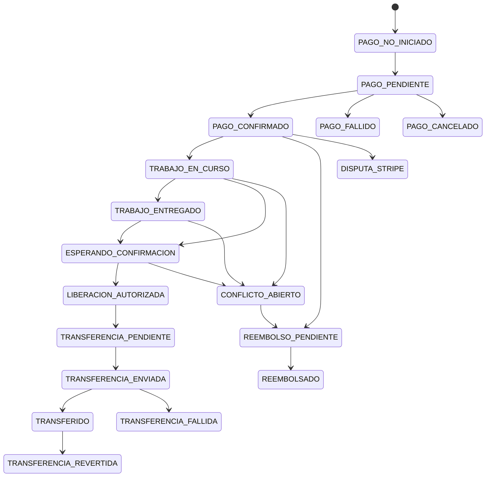

# Financial Transaction State Machine

Documentación técnica del modelo financiero transaccional de RUANA.

> **Actualización 2026-09-04:** las fases 02–13 están **implementadas** en código. La sección histórica «esta fase NO implementa» aplica solo a la FASE 01 original (modelo de estados).

## Objetivo

## Separación de conceptos

| Campo | Significado |
|-------|-------------|
| `contactos_ruana.estado` | Estado operativo del encargo/servicio (`trabajo_en_progreso`, `trabajo_cerrado`, …) |
| `contactos_ruana.estado_pago` | Estado legacy de pago (manual + Stripe). **Se mantiene por compatibilidad.** |
| `contactos_ruana.estado_financiero` | Estado canónico de la operación financiera (FASE 01) |
| `contactos_ruana.estado_transferencia` | Sub-estado del dinero (`RETENIDO`, `PENDIENTE`, `ENVIADA`, `COMPLETADA`, …) |

> **Regla:** `trabajo_entregado` ≠ `dinero_transferido`. El estado del servicio y el del dinero viven en columnas distintas.

## Estados

### Flujo normal

| Estado | Descripción |
|--------|-------------|
| `PAGO_NO_INICIADO` | Sin cobro iniciado |
| `PAGO_PENDIENTE` | Checkout / cobro en curso |
| `PAGO_CONFIRMADO` | Cobro confirmado por Stripe |
| `TRABAJO_EN_CURSO` | Profesional realizando el trabajo |
| `TRABAJO_ENTREGADO` | Trabajo marcado como entregado |
| `ESPERANDO_CONFIRMACION` | Esperando confirmación del contratante |
| `LIBERACION_AUTORIZADA` | Contratante autorizó liberación del importe retenido |
| `TRANSFERENCIA_PENDIENTE` | Transferencia al profesional pendiente de ejecución |
| `TRANSFERENCIA_ENVIADA` | Transfer Stripe enviada (pendiente de reconciliación) |
| `TRANSFERIDO` | Transferencia completada operativamente |

### Excepción

| Estado | Descripción |
|--------|-------------|
| `PAGO_FALLIDO` | Cobro fallido |
| `PAGO_CANCELADO` | Cobro cancelado |
| `CONFLICTO_ABIERTO` | Conflicto activo (`payment_conflicts` o disputa de importe) |
| `REEMBOLSO_PENDIENTE` | Reembolso iniciado (**FASE 05** — `financial_refund_service`) |
| `REEMBOLSADO` | Reembolso completado (**FASE 05**) |
| `DISPUTA_STRIPE` | Disputa/chargeback Stripe (**FASE 06** — `financial_dispute_service`) |
| `TRANSFERENCIA_FALLIDA` | Transferencia fallida |
| `TRANSFERENCIA_REVERTIDA` | Transferencia revertida |
| `CANCELADO` | Operación cancelada |
| `MIGRACION_PENDIENTE` | Estado no inferible con seguridad en datos legacy |

### Estados terminales

`TRANSFERIDO`, `PAGO_FALLIDO`, `PAGO_CANCELADO`, `REEMBOLSADO`, `CANCELADO`, `TRANSFERENCIA_REVERTIDA`

## Diagrama Mermaid



## Transiciones bloqueadas

Un `CONFLICTO_ABIERTO` **impide** transiciones hacia:

- `LIBERACION_AUTORIZADA`
- `TRANSFERENCIA_PENDIENTE`
- `TRANSFERENCIA_ENVIADA`
- `TRANSFERIDO`

Transiciones arbitrarias (ej. `PAGO_PENDIENTE → TRANSFERIDO`) son **rechazadas** por `FinancialStateMachine`.

## Invariantes financieras

1. `importe_bruto >= 0`
2. `comision_ruana >= 0`
3. `importe_profesional >= 0`
4. `comision_ruana + importe_profesional == importe_bruto`
5. Una operación no puede tener dos transferencias válidas
6. Reembolsos acumulados ≤ importe bruto
7. Conflicto abierto bloquea transferencia
8. `TRANSFERIDO` no puede volver a `TRANSFERENCIA_PENDIENTE`
9. Operación cancelada no retorna al flujo normal
10. Importe inmutable tras pago confirmado

Implementación: `core/financial/modelo.py` y `core/financial/state_machine.py`.

## Mapeo legacy (`estado_pago`)

| Legacy (Stripe) | `estado_financiero` |
|-----------------|---------------------|
| `esperando_cobro_cliente` / `checkout_activo` | `PAGO_PENDIENTE` |
| `cobro_confirmado` | `ESPERANDO_CONFIRMACION` |
| `transferido` | `TRANSFERIDO` |
| `revision_admin` | `CONFLICTO_ABIERTO` |

| Legacy (manual) | `estado_financiero` |
|-----------------|---------------------|
| `no_generado` | `PAGO_NO_INICIADO` |
| `pendiente_pago` / `en_revision` / `pagado` | `PAGO_CONFIRMADO` |

Código: `core/financial/mapeo_legacy.py`.

## Relación con Stripe

| Campo RUANA | Uso Stripe |
|-------------|------------|
| `stripe_checkout_session_id` | Checkout Session |
| `stripe_payment_intent_id` | PaymentIntent (idempotencia cobro) |
| `stripe_transfer_id` | Transfer al profesional Connect |
| `stripe_refund_id` | Reservado (fase futura) |
| `stripe_dispute_id` | Reservado (fase futura) |

**Stripe es la fuente de verdad del dinero real.** RUANA es la fuente de verdad operativa. La reconciliación se implementará en fases posteriores.

## Auditoría

Cada transición registra en `audit_log`:

- `accion`: `financiero_transicion`
- `detalles` (JSON): `estado_anterior`, `estado_nuevo`, `motivo`, `stripe_ref`

Servicio: `core/services/financial_transaction_service.py` → reutiliza `admin_service._audit_log`.

## Idempotencia existente (reutilizada)

| Mecanismo | Ubicación |
|-----------|-----------|
| `stripe_webhook_events.stripe_event_id UNIQUE` | `pago_repo.webhook_evento_existe` |
| `idempotency_key` en Checkout/Transfer | `stripe_client` + `pago_service` |
| Guardia `stripe_payment_intent_id IS NULL` | `pago_repo.marcar_cobro_stripe_confirmado` |
| Guardia `stripe_transfer_id IS NULL` | `pago_repo.marcar_transfer_stripe_completado` |
| Tabla `financial_idempotency_keys` | Preparada para fases futuras |

## Concurrencia

`financial_transaction_service.transicionar` usa **compare-and-swap** atómico:

```sql
UPDATE contactos_ruana SET estado_financiero = ?
WHERE id = ? AND estado_financiero = ?
```

Protege contra doble autorización de liberación (`ESPERANDO_CONFIRMACION → LIBERACION_AUTORIZADA`).

## Archivos principales

| Archivo | Rol |
|---------|-----|
| `core/financial/estados.py` | Enums de estado |
| `core/financial/state_machine.py` | Transiciones permitidas |
| `core/financial/modelo.py` | Invariantes de importes |
| `core/financial/mapeo_legacy.py` | Compatibilidad `estado_pago` |
| `core/services/financial_transaction_service.py` | Orquestación + auditoría |
| `core/repositories/financial_transaction_repo.py` | Persistencia |
| `tests/test_financial_state_machine.py` | Tests FASE 01 |

## Qué NO hace esta fase

- No modifica Stripe Checkout, PaymentIntent ni Transfer API
- No implementa webhooks nuevos
- No implementa reembolsos ni disputas
- No implementa reconciliación Stripe ↔ RUANA
- No cambia el frontend ni el 12 % de comisión
- No elimina la lógica manual Bizum/IBAN

## Integración mínima con flujo actual

Hooks en `pago_service.py` (sin cambiar comportamiento Stripe):

1. `activar_pago_stripe_tras_acuerdo` → `PAGO_PENDIENTE`
2. `_procesar_pago_confirmado` → `PAGO_CONFIRMADO` → `TRABAJO_EN_CURSO` → `ESPERANDO_CONFIRMACION`
3. `confirmar_trabajo_y_transferir` → `LIBERACION_AUTORIZADA` → ciclo hasta `TRANSFERIDO`
